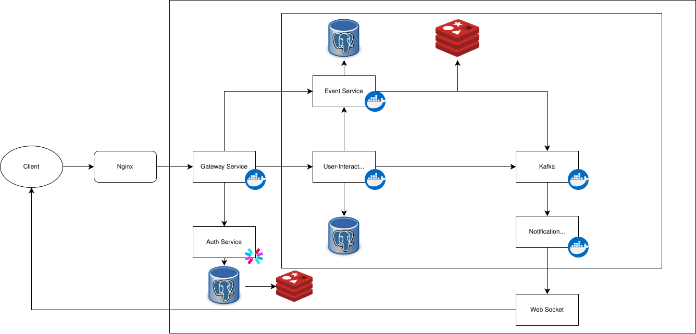

# Eventify

**Eventify** — это микросервисное веб-приложение для управления событиями, построенное на Go с использованием современных технологий и архитектурных паттернов.

## Описание проекта

Eventify позволяет пользователям:
- Регистрироваться и аутентифицироваться
- Создавать и просматривать события
- Регистрироваться на события и оставлять отзывы
- Получать уведомления через Kafka
- Использовать единый API через Gateway сервис


### Микросервисы:

- **Auth Service** (Port: 9091) — аутентификация и управление пользователями
- **Event Service** (Port: 9092) — создание и управление событиями
- **User-Interact Service** (Port: 9093) — отзывы и регистрация на события
- **Notification Service** (Port: 9095) — отправка уведомлений через Kafka
- **Gateway Service** (Port: 9097) — единая точка входа для всех API запросов

## Диаграмма архитектуры



## Технологический стек

### Основные технологии
- **Язык программирования**: Go 1.24.0
- **База данных**: PostgreSQL с pgx драйвером
- **Конфигурация**: cleanenv + YAML
- **Логирование**: Zap (Uber)

### Межсервисное взаимодействие
- **gRPC** — для внутреннего взаимодействия сервисов
- **gRPC-Gateway** — HTTP прокси для gRPC сервисов
- **Kafka** — асинхронная обработка событий

### Дополнительные технологии
- **JWT**: golang-jwt для аутентификации
- **Kafka**: segmentio/kafka-go для асинхронных уведомлений
- **Хеширование**: golang.org/x/crypto для паролей
- **Кэш**: Redis (go-redis)
- **Контейнеризация**: Docker & Docker Compose

### Инфраструктура
- **Docker** — контейнеризация
- **Docker Compose** — оркестрация сервисов
- **Goose** — миграции базы данных
- **Redis** — кэширование
- **golangci-lint** — статический анализ кода

## Структура проекта

```
eventify/
├── auth/                          # Сервис аутентификации
│   ├── api/                       # gRPC API определения
│   ├── cmd/
│   │   └── main.go
│   └── internal/
│       ├── config/
│       ├── handler/
│       ├── models/
│       ├── repository/
│       └── service/
├── event/                         # Сервис событий
│   ├── api/                       # gRPC API определения
│   ├── cmd/
│   │   └── main.go
│   └── internal/
│       ├── config/
│       ├── handler/
│       ├── models/
│       ├── repository/
│       └── service/
├── user-interact/                 # Сервис взаимодействий
│   ├── api/                       # gRPC API определения
│   ├── cmd/
│   │   └── main.go
│   └── internal/
│       ├── config/
│       ├── handler/
│       ├── models/
│       ├── repository/
│       └── service/
├── gateway/                       # Gateway сервис
│   ├── cmd/
│   │   └── main.go
│   ├── internal/
│   │   ├── config/
│   │   ├── middleware/            # HTTP middleware
│   │   └── service/
│   ├── go.mod
│   ├── Makefile
│   ├── README.md
│   └── test_gateway.sh
├── notification/                  # Сервис уведомлений
│   ├── cmd/
│   │   └── main.go
│   ├── internal/
│   │   ├── config/
│   │   ├── service/
│   │   └── wsserver/              # WebSocket сервер
│   ├── web/                       # WebSocket клиент
│   │   └── html/
│   ├── go.mod
│   └── Makefile
├── common/                        # Общие компоненты
│   ├── jwt/
│   ├── kafka/
│   ├── logger/
│   ├── postgres/
│   ├── redis/
│   └── retry/
│
├── configs/                       # Конфигурационные файлы
│   └── config.yaml
├── migrations/                    # SQL миграции
├── build/                         # Артефакты сборки
│   └── docker/
├── third_party/                   # Внешние зависимости
└── Makefile                       # Основной Makefile
```

## Запуск проекта

### Предварительные требования
- Go 1.24.0+
- PostgreSQL 14+
- Kafka 3.0+
- Redis 6+
- Docker & Docker Compose
- Make

### Установка и запуск

#### 1. Клонирование репозитория
```bash
git clone https://github.com/eventify.git
cd eventify
```

#### 2. Установка зависимостей
```bash
# Установка инструментов разработки
make install-deps
make install-golangci-lint

# Установка зависимостей для всех сервисов
cd auth && go mod tidy
cd ../event && go mod tidy
cd ../user-interact && go mod tidy
cd ../gateway && go mod tidy
cd ../common && go mod tidy
```

#### 3. Настройка окружения
```bash
# Копирование конфигурации
cp configs/config.yaml.example configs/config.yaml

# Настройка переменных окружения
cp configs/.env.example configs/.env
```

#### 4. Запуск с Docker Compose
```bash
# Запуск всех сервисов
make up

# Просмотр логов
make logs

# Остановка сервисов
make down
```

#### 5. Локальная разработка
```bash
# Запуск инфраструктуры (пример)
docker-compose -f build/docker/docker-compose.yaml up -d postgres kafka redis

# Применение миграций
make local-migration-up

# Запуск сервисов локально
make run-all
```

## Команды Make

### Основные команды
```bash
make up              # Запуск всех сервисов через Docker
make down            # Остановка всех сервисов
make restart         # Перезапуск сервисов
make logs            # Просмотр логов
```

### Разработка
```bash
make lint            # Проверка кода
make install-deps    # Установка зависимостей
make install-golangci-lint  # Установка линтера
```

### Миграции
```bash
make local-migration-status  # Статус миграций
make local-migration-up      # Применение миграций
make local-migration-down    # Откат миграций
```

### Gateway сервис
```bash
make gateway-build    # Сборка gateway
make gateway-run      # Запуск gateway
make gateway-dev      # Разработка gateway
make gateway-clean    # Очистка gateway
```

### Все сервисы
```bash
make build-all        # Сборка всех сервисов
make run-all          # Запуск всех сервисов локально
```

## API документация (Swagger)

Swagger-документация доступна на порту 9097.

### Запуск тестов для всех сервисов
```bash
# Запуск тестов для каждого сервиса
cd auth && go test ./...
cd ../event && go test ./...
cd ../user-interact && go test ./...
cd ../gateway && go test ./...
```

## База данных

### Основные таблицы
- **users** — пользователи системы
- **events** — события
- **event_participants** — участники событий
- **reviews** — отзывы на события

### Миграции
Проект использует Goose для управления миграциями:
```bash
# Применение миграций
make local-migration-up

# Откат миграций
make local-migration-down

# Статус миграций
make local-migration-status
```

## Отладка

### Логи
```bash
# Просмотр логов всех сервисов
make logs

# Логи конкретного сервиса
docker-compose -f build/docker/docker-compose.yaml logs -f auth-service
```

### Подключение к базе данных
```bash
docker exec -it eventify-postgres-1 psql -U eventify-user -d eventify
```

### Проверка Kafka
```bash
docker exec -it eventify-kafka-1 kafka-topics --list --bootstrap-server localhost:9095
```

## Формат ответов

Все ответы — в формате JSON, ошибки также возвращаются в JSON:

```json
{
  "error": "Invalid credentials",
  "code": 401
}
```

## Коды состояния

| Код | Значение                  |
| --- | ------------------------- |
| 200 | Успешно                   |
| 201 | Ресурс создан             |
| 400 | Ошибка в запросе          |
| 401 | Неавторизован             |
| 404 | Не найдено                |
| 500 | Внутренняя ошибка сервера |

## CI/CD

### Линтинг
```bash
make lint
```

### Сборка
```bash
make build-all
```
